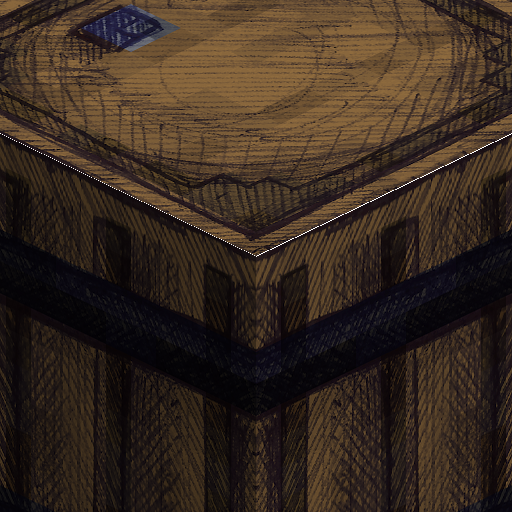

<h1> Colored Paddy's Hand-drawn Textures</h1>

**A simple Python script to create a colored version of Paddy's Hand-Drawn Textures.** This is done by layering the Minecraft texture over the hand-drawn texture with a clipping mask and multiplying colors.

> [!NOTE]
> This project is not affiliated with CreativePaddy, Minecraft, Mojang, or Microsoft. If you like this resource pack, go support CreativePaddy instead :)

## How to setup
1. Make sure you have **[Git](https://git-scm.com/)** and **[Python](https://www.python.org/)** installed
2. Clone the repository and install dependencies:
    ```bash
    git clone https://github.com/codyiscod/Colored_Paddy-s_Hand-Drawn_Textures.git

    cd Colored_Paddy-s_Hand-Drawn_Textures

    pip install -r requirements.txt
    ```

## How to add color
1. Download **[Paddy's Hand-drawn Textures](https://modrinth.com/resourcepack/paddys-handdrawn-textures)** and the **[minecraft-assets](https://github.com/InventivetalentDev/minecraft-assets)** for your Minecraft version. **Extract** these packs into the root repository folder.
    
    - To download **[minecraft-assets](https://github.com/InventivetalentDev/minecraft-assets)**, change from the `master` **branch** to, for example, `26.1`

    - **If done right, you should have a folder containing:**
        - `main.py` *(adds color to textures)*
        - `isometric.py` *(makes pack.png)*
        - a `minecraft-assets` folder containing `pack.mcmeta`
        - a `Paddy's Hand-drawn Textures` folder containing `pack.mcmeta`.

2. Open `main.py` and **change these variables** to your **extracted folder's names**:
    ```python
    MC_PACK = SCRIPT_DIR / "minecraft-assets"
    PADDY_PACK = SCRIPT_DIR / "Paddy's_Hand-Drawn_Textures_26.1_v0.11wip"
    ```

3. Run `main.py`:
    ```bash
    python main.py
    ```
    The **converted resource pack** will be **automatically created at** `/Colored_PaddyFolderNameHere`